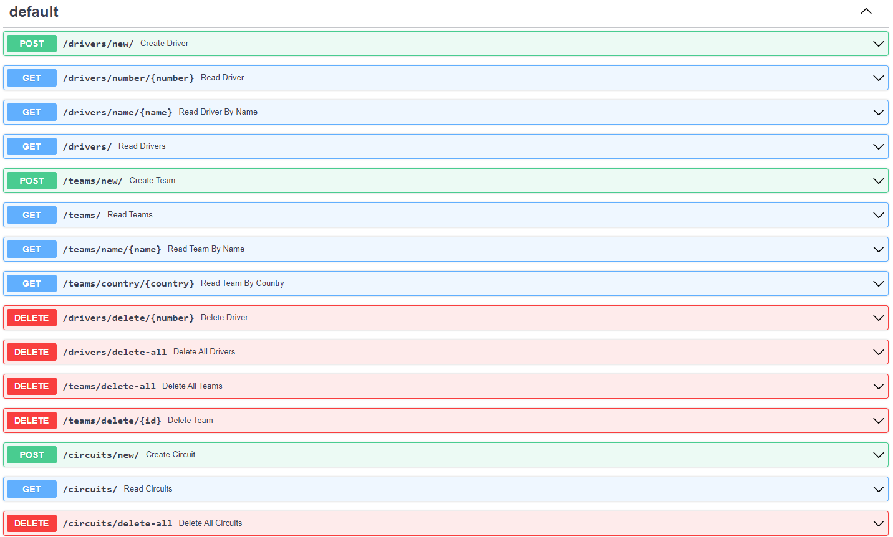
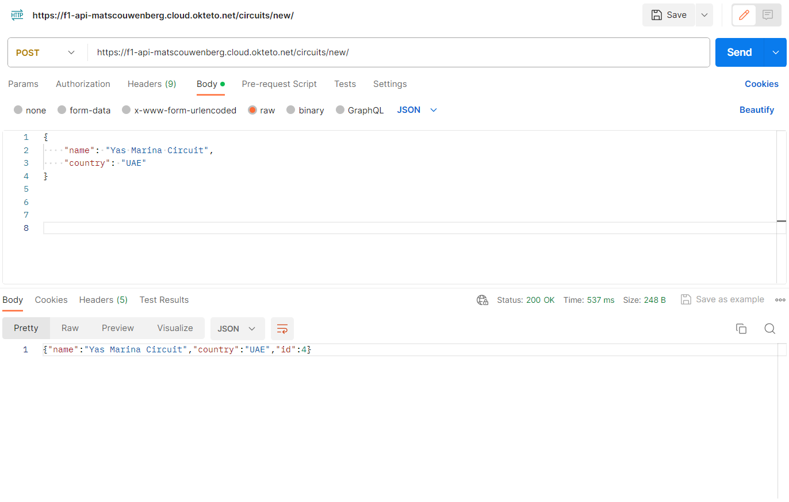
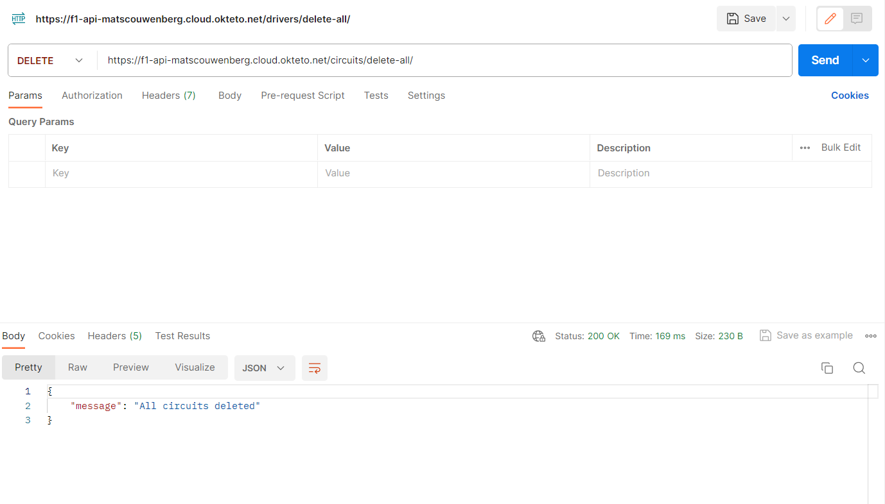
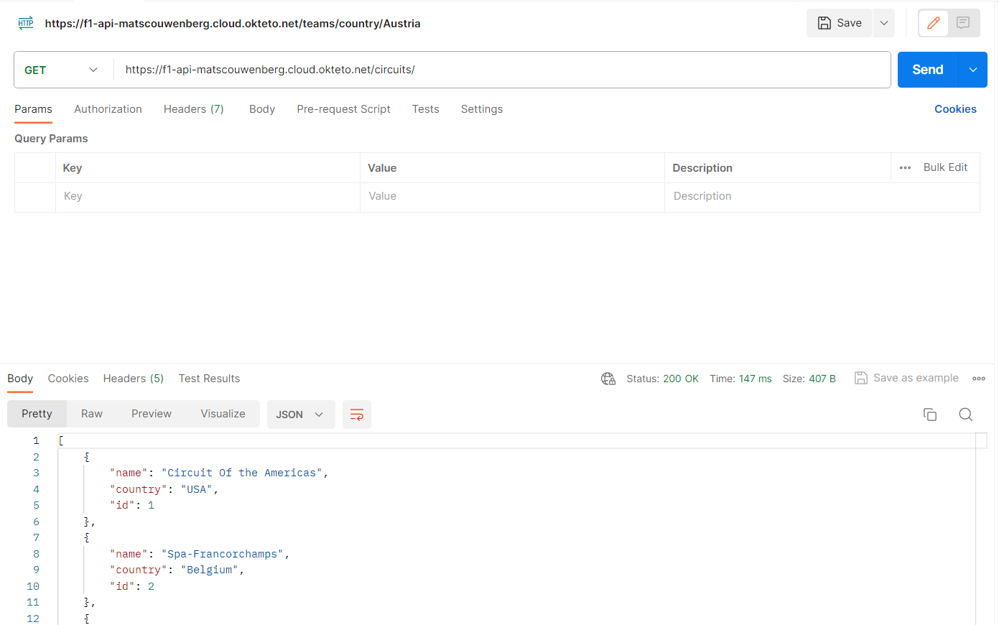
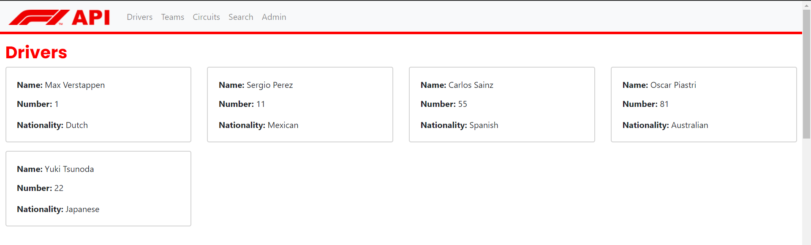
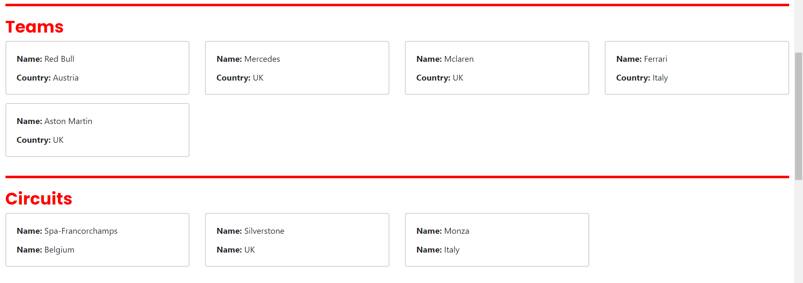
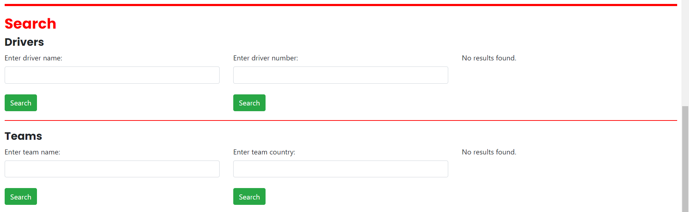
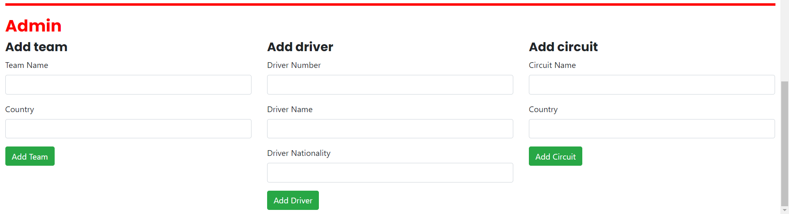

# API Development assignment: F1 API
I chose to use Formula One as a theme for this assignment because that was the first thing that came to my mind, and I really like watching Formula One. The API consists of 3 main parts, circuits, teams and drivers.

## My endpoints
In total, I have 15 endpoints in this API. 3 Of them are POST, 5 of them are DELETE and the remaining 7 of them are GET endpoints.

### POST endpoints
I have made 1 POST to create a new team, 1 POST to create a circuit, and 1 POST to create a new driver. You can use them on my front-end as well as on Postman:

### DELETE endpoints
In this API are 5 DELETE endpoints, you can delete all drivers at once or all teams at once. You can also specify a driver number to delete that driver. To delete a specific team you need to use their ID. You can also delete all the circuits at once.
Drivers:

Teams:

Circuits:

### GET endpoints
I have 7 GET endpoints, 3 for teams, 3 for drivers and 1 to get all the circuits.
Drivers:

Teams:

Circuits:

## My front-end
Here is an image of my new front-end I made with Vue.js and Bootstrap. With this page you can see a list of every driver, circuit and team. You can also add new drivers, circuits and teams to the list. You can search driver by name and number, and teams by name and their country.

## Links
-  [Hosted API link](https://f1-api-matscouwenberg.cloud.okteto.net/)
-  [Hosted front-end link](https://stellular-gelato-a0cab1.netlify.app/)
-  [GitHub repo link](https://github.com/MatsCouwenberg/API_dev_2)